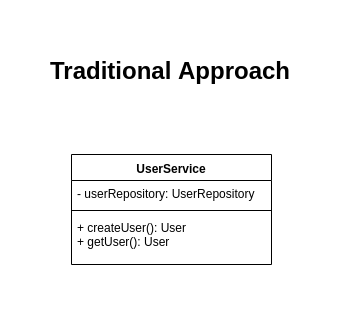
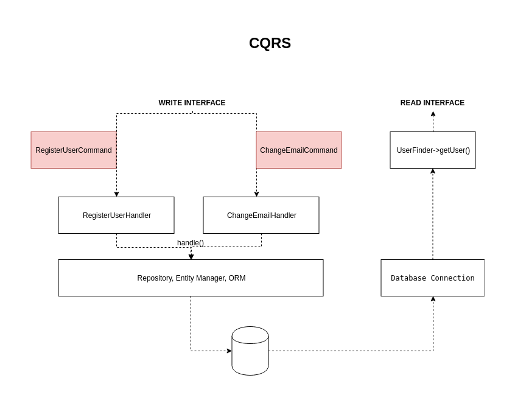

[Home](../README.md) > Ad-hoc Examples

---

# Ad-hoc examples

```
# Creating and output Command instance
docker-compose exec php php examples/say_hello.php

# UserService function based on CQRS principle
docker-compose exec php php examples/cqrs.php 
```



